# WorkNPay - System Analysis and Design Documentation

## Table of Contents
1. [Introduction](#introduction)
2. [System Overview](#system-overview)
3. [System Architecture](#system-architecture)
4. [Database Design](#database-design)
5. [Use Case Analysis](#use-case-analysis)
6. [System Workflows](#system-workflows)
7. [Security Architecture](#security-architecture)
8. [Deployment Architecture](#deployment-architecture)
9. [GitHub Repository](#github-repository)

---

## 1. Introduction

### 1.1 Project Overview
**WorkNPay** is a mobile-first service marketplace platform designed to connect customers with verified skilled and semi-skilled workers in Ghana's informal sector. The platform facilitates service discovery, booking, secure payments with escrow, and dispute resolution.

### 1.2 Purpose
This document provides a comprehensive analysis and design of the WorkNPay system, including architectural diagrams, database schemas, workflow visualizations, and technical specifications.

### 1.3 Scope
- Service marketplace for skilled workers
- Booking and scheduling system
- Payment processing with escrow
- Worker verification and rating system
- Dispute resolution mechanism
- Multi-role user management (Customer, Worker, Admin)

### 1.4 Target Users
- **Customers**: Individuals seeking skilled services
- **Workers**: Skilled and semi-skilled professionals offering services
- **Administrators**: Platform managers overseeing operations

---

## 2. System Overview

### 2.1 Key Features

**Customer Features**
- Service search and filtering
- Worker profile browsing
- Service booking and scheduling
- Secure payment processing
- Order tracking
- Rating and review system
- Dispute management

**Worker Features**
- Profile and service management
- Booking request handling
- Job tracking and status updates
- Earnings management
- Payout requests (instant and scheduled)
- Customer communication
- Portfolio showcase

**Admin Features**
- User management and verification
- Platform oversight
- Dispute resolution
- Transaction monitoring
- Reporting and analytics

### 2.2 Technology Stack

**Backend**
- PHP 8.x
- MySQL 8.0
- MVC Architecture Pattern

**Frontend**
- HTML5
- CSS3 (with custom theme variables)
- Vanilla JavaScript
- AJAX (Fetch API)

**Third-Party Services**
- Paystack Payment Gateway
- InfinityFree Hosting (current)

**Development Tools**
- Git for version control
- GitHub for repository hosting
- XAMPP for local development

---

## 3. System Architecture

### 3.1 High-Level Architecture

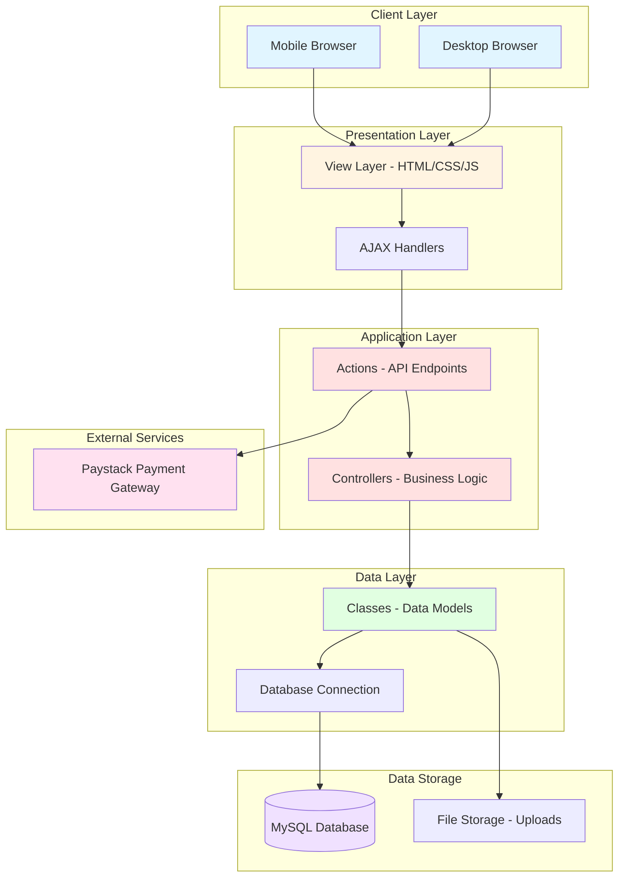

### 3.2 MVC Architecture Pattern

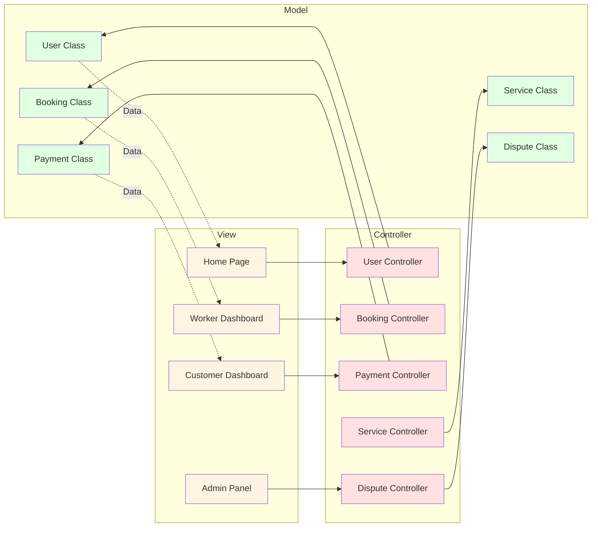

### 3.3 Directory Structure

```
worknpay/
├── actions/              # API endpoints and action handlers
│   ├── login_action.php
│   ├── create_booking_action.php
│   ├── booking_payment_init.php
│   └── ...
├── classes/              # Data models (Model layer)
│   ├── user_class.php
│   ├── booking_class.php
│   ├── payment_class.php
│   └── ...
├── controllers/          # Business logic (Controller layer)
│   ├── user_controller.php
│   ├── booking_controller.php
│   ├── payment_controller.php
│   └── ...
├── view/                 # User interfaces (View layer)
│   ├── home.php
│   ├── worker_dashboard_new.php
│   ├── admin_bookings.php
│   └── ...
├── settings/             # Configuration files
│   ├── core.php
│   ├── db_class.php
│   ├── db_cred.php
│   ├── paystack_config.php
│   └── environment.php
├── css/                  # Stylesheets
├── js/                   # JavaScript files
├── db/                   # Database schemas
├── uploads/              # User-uploaded files
│   ├── profile_photos/
│   └── completion_photos/
└── index.php             # Application entry point
```

---

## 4. Database Design

### 4.1 Entity Relationship Diagram (ERD)

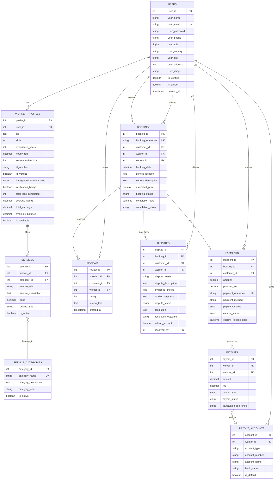

### 4.2 Database Schema Summary

**Core Tables**
- `users` - All user accounts (customers, workers, admins)
- `worker_profiles` - Extended worker information
- `service_categories` - Service classification
- `services` - Worker service offerings

**Transaction Tables**
- `bookings` - Service booking records
- `payments` - Payment transactions with escrow
- `payouts` - Worker payout records
- `payout_accounts` - Worker bank/mobile money accounts

**Engagement Tables**
- `reviews` - Customer ratings and reviews
- `disputes` - Dispute management
- `messages` - In-app messaging (future)

---

## 5. Use Case Analysis

### 5.1 Use Case Diagram

```mermaid
graph TB
    subgraph "WorkNPay System"
        UC1[Search Services]
        UC2[Book Service]
        UC3[Make Payment]
        UC4[Track Booking]
        UC5[Rate & Review]
        UC6[Open Dispute]
        
        UC7[Manage Profile]
        UC8[Manage Services]
        UC9[Accept/Decline Booking]
        UC10[Update Job Status]
        UC11[Request Payout]
        
        UC12[Verify Workers]
        UC13[Resolve Disputes]
        UC14[Monitor Platform]
        UC15[Manage Users]
    end
    
    Customer([Customer])
    Worker([Worker])
    Admin([Admin])
    Paystack[Paystack Gateway]
    
    Customer --> UC1
    Customer --> UC2
    Customer --> UC3
    Customer --> UC4
    Customer --> UC5
    Customer --> UC6
    
    Worker --> UC7
    Worker --> UC8
    Worker --> UC9
    Worker --> UC10
    Worker --> UC11
    
    Admin --> UC12
    Admin --> UC13
    Admin --> UC14
    Admin --> UC15
    
    UC3 -.-> Paystack
    UC11 -.-> Paystack
    
    style Customer fill:#e1f5ff
    style Worker fill:#e1ffe1
    style Admin fill:#ffe1e1
    style Paystack fill:#f0e1ff
```

### 5.2 Key Use Cases

#### UC1: Customer Books a Service

**Actors**: Customer, Worker, System, Paystack

**Preconditions**: 
- Customer is registered and logged in
- Worker has active services

**Main Flow**:
1. Customer searches for services
2. Customer filters by category, location, price, rating
3. Customer views worker profile
4. Customer selects service and date
5. Customer provides service location and details
6. System generates booking reference
7. Customer proceeds to payment
8. System redirects to Paystack
9. Customer completes payment
10. Paystack verifies payment
11. System holds payment in escrow
12. System notifies worker of new booking
13. Worker accepts booking
14. System confirms booking to customer

**Postconditions**: 
- Booking created with "confirmed" status
- Payment held in escrow
- Both parties notified

#### UC2: Worker Completes Service

**Actors**: Worker, Customer, System

**Preconditions**: 
- Booking is confirmed
- Service date has arrived

**Main Flow**:
1. Worker marks booking as "in progress"
2. Worker performs service
3. Worker uploads completion photo
4. Worker marks booking as "completed"
5. System notifies customer
6. Customer confirms completion OR 24 hours pass
7. System releases payment from escrow
8. System calculates worker earnings (minus 5% commission)
9. System updates worker available balance
10. Customer can rate and review

**Postconditions**: 
- Booking status is "completed"
- Payment released to worker
- Worker balance updated
- Review option available

#### UC3: Customer Opens Dispute

**Actors**: Customer, Worker, Admin, System

**Preconditions**: 
- Booking is completed
- Within 48-hour dispute window

**Main Flow**:
1. Customer opens dispute with reason
2. Customer uploads evidence
3. System notifies worker
4. Worker responds to dispute
5. Worker uploads counter-evidence
6. System notifies admin
7. Admin reviews both sides
8. Admin makes resolution decision
9. System processes refund (if applicable)
10. System notifies both parties

**Postconditions**: 
- Dispute resolved
- Refund processed (if applicable)
- Both parties notified

---

## 6. System Workflows

### 6.1 Booking and Payment Flow

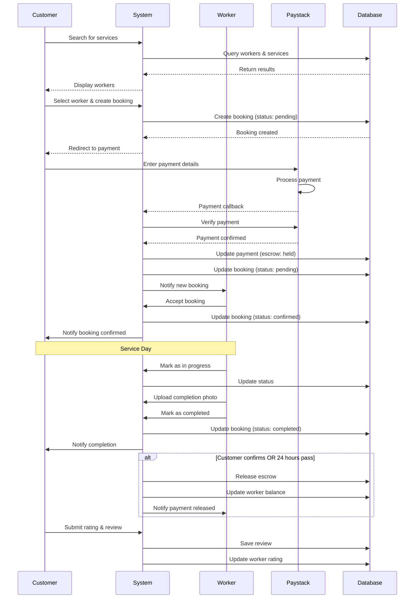

### 6.2 Payout Request Flow

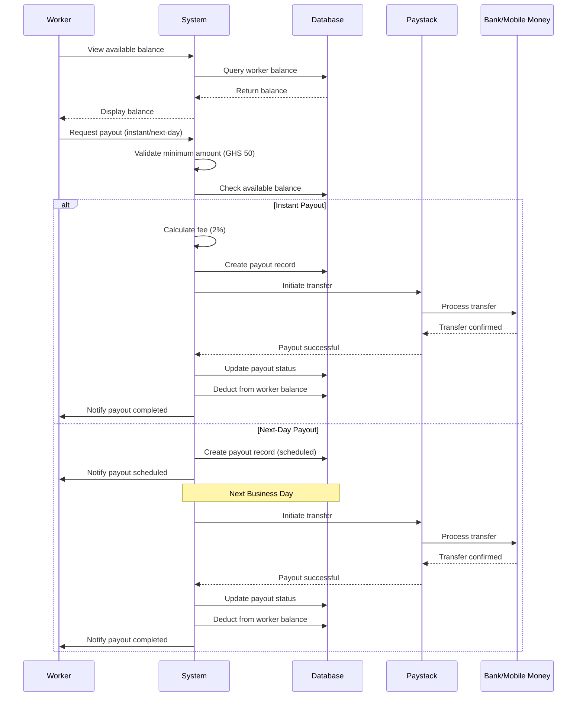

### 6.3 Dispute Resolution Flow

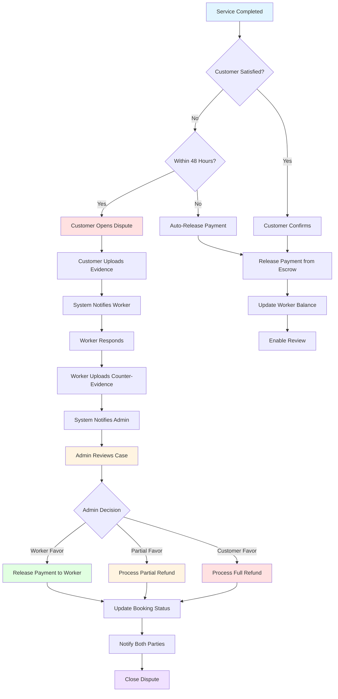

---

## 7. Security Architecture

### 7.1 Security Layers

```mermaid
graph TB
    subgraph "Security Layers"
        L1[Application Layer Security]
        L2[Authentication & Authorization]
        L3[Data Security]
        L4[Payment Security]
        L5[Infrastructure Security]
    end
    
    subgraph "Application Layer"
        A1[Input Validation]
        A2[SQL Injection Prevention]
        A3[XSS Prevention]
        A4[File Upload Validation]
    end
    
    subgraph "Auth Layer"
        B1[Session Management]
        B2[Password Hashing]
        B3[Role-Based Access Control]
        B4[Login Protection]
    end
    
    subgraph "Data Layer"
        C1[Database Encryption]
        C2[Secure Configuration]
        C3[Environment Separation]
        C4[Sensitive Data Protection]
    end
    
    subgraph "Payment Layer"
        D1[Paystack Integration]
        D2[Escrow System]
        D3[Transaction Verification]
        D4[PCI Compliance]
    end
    
    subgraph "Infrastructure"
        E1[HTTPS Enforcement]
        E2[Secure File Storage]
        E3[Access Control]
        E4[Error Logging]
    end
    
    L1 --> A1
    L1 --> A2
    L1 --> A3
    L1 --> A4
    
    L2 --> B1
    L2 --> B2
    L2 --> B3
    L2 --> B4
    
    L3 --> C1
    L3 --> C2
    L3 --> C3
    L3 --> C4
    
    L4 --> D1
    L4 --> D2
    L4 --> D3
    L4 --> D4
    
    L5 --> E1
    L5 --> E2
    L5 --> E3
    L5 --> E4
    
    style L1 fill:#ffe1e1
    style L2 fill:#e1f5ff
    style L3 fill:#e1ffe1
    style L4 fill:#fff4e1
    style L5 fill:#f0e1ff
```

### 7.2 Authentication Flow

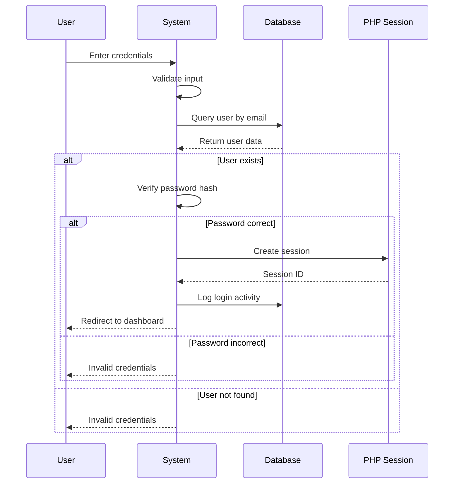

### 7.3 Payment Security Flow

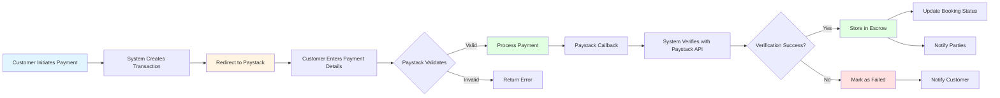

---

## 8. Deployment Architecture

### 8.1 Current Deployment

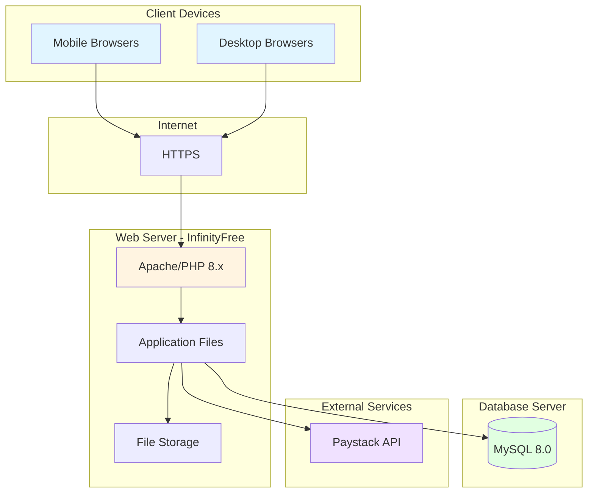

### 8.2 Environment Configuration

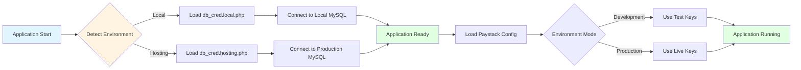

### 8.3 Recommended Production Architecture

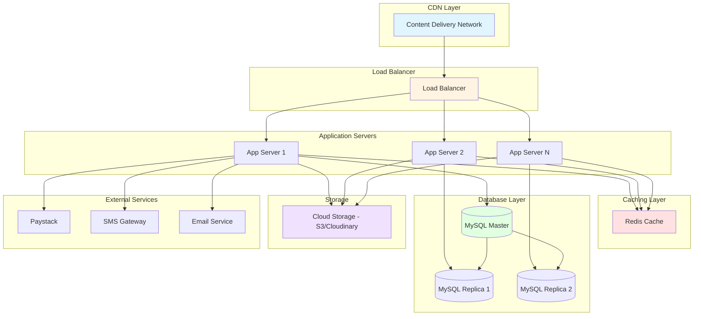

---

## 9. GitHub Repository

### 9.1 Repository Information

**Repository URL**: [https://github.com/oforias/worknpay](https://github.com/oforias/worknpay)

**Repository Structure**:
```
worknpay/
├── .git/                    # Git version control
├── .gitignore              # Excluded files configuration
├── actions/                # API endpoints (30+ files)
├── classes/                # Data models
├── controllers/            # Business logic
├── view/                   # User interfaces
├── settings/               # Configuration files
├── css/                    # Stylesheets
├── js/                     # JavaScript files
├── db/                     # Database schemas
├── uploads/                # User uploads (git-ignored)
├── archive/                # Development files (git-ignored)
├── .kiro/                  # Spec files (git-ignored)
├── index.php               # Application entry point
├── README.md               # Project documentation
├── PRODUCT_DEVELOPMENT_REQUIREMENTS.md
└── SYSTEM_ANALYSIS_AND_DESIGN.md
```

### 9.2 Code Quality Standards

**PHP Code Standards**:
- PSR-12 coding style
- Proper indentation (4 spaces)
- Clear function and variable naming
- Comprehensive inline comments
- DocBlock comments for classes and methods
- Error handling and logging

**Example - Well-Commented Code**:
```php
<?php
/**
 * Dispute Class
 * Handles dispute management operations
 */

require_once(__DIR__ . '/../settings/db_class.php');

class Dispute extends db_connection
{
    /**
     * Delete/Cancel a dispute (only if not resolved)
     * 
     * @param int $dispute_id The ID of the dispute to delete
     * @return bool True if deletion successful, false otherwise
     */
    public function delete_dispute($dispute_id)
    {
        // Sanitize input
        $dispute_id = (int)$dispute_id;
        
        // Check if dispute exists and is still open
        $dispute = $this->get_dispute_by_id($dispute_id);
        if (!$dispute) {
            return false;
        }
        
        // Prevent deletion of resolved disputes
        if ($dispute['dispute_status'] === 'resolved') {
            return false;
        }
        
        // Delete the dispute
        $sql = "DELETE FROM disputes WHERE dispute_id = $dispute_id";
        
        return $this->db_query($sql);
    }
}
?>
```

### 9.3 Git Workflow

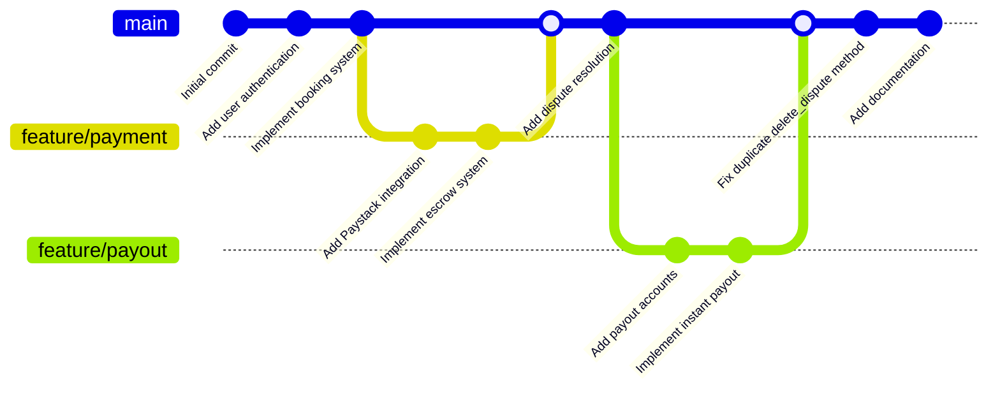

### 9.4 Version Control Best Practices

**Commit Message Format**:
```
<type>: <subject>

<body>

<footer>
```

**Types**:
- `feat`: New feature
- `fix`: Bug fix
- `docs`: Documentation changes
- `style`: Code style changes (formatting)
- `refactor`: Code refactoring
- `test`: Adding tests
- `chore`: Maintenance tasks

**Example Commits**:
```
feat: Add instant payout functionality

- Implement instant payout with 2% fee
- Add payout account management
- Create payout history tracking

Closes #45

---

fix: Fix duplicate delete_dispute method

- Remove duplicate method definition
- Keep version with validation logic
- Ensure proper class closure

Fixes #67

---

docs: Add system analysis and design documentation

- Create comprehensive architecture diagrams
- Add ERD and use case diagrams
- Document security architecture
- Include deployment architecture
```

### 9.5 Branch Strategy

**Main Branches**:
- `main` - Production-ready code
- `develop` - Development branch (future)

**Feature Branches**:
- `feature/booking-system`
- `feature/payment-integration`
- `feature/dispute-resolution`
- `feature/payout-system`

**Hotfix Branches**:
- `hotfix/security-patch`
- `hotfix/payment-bug`

---

## 10. System Components Detail

### 10.1 User Management Component

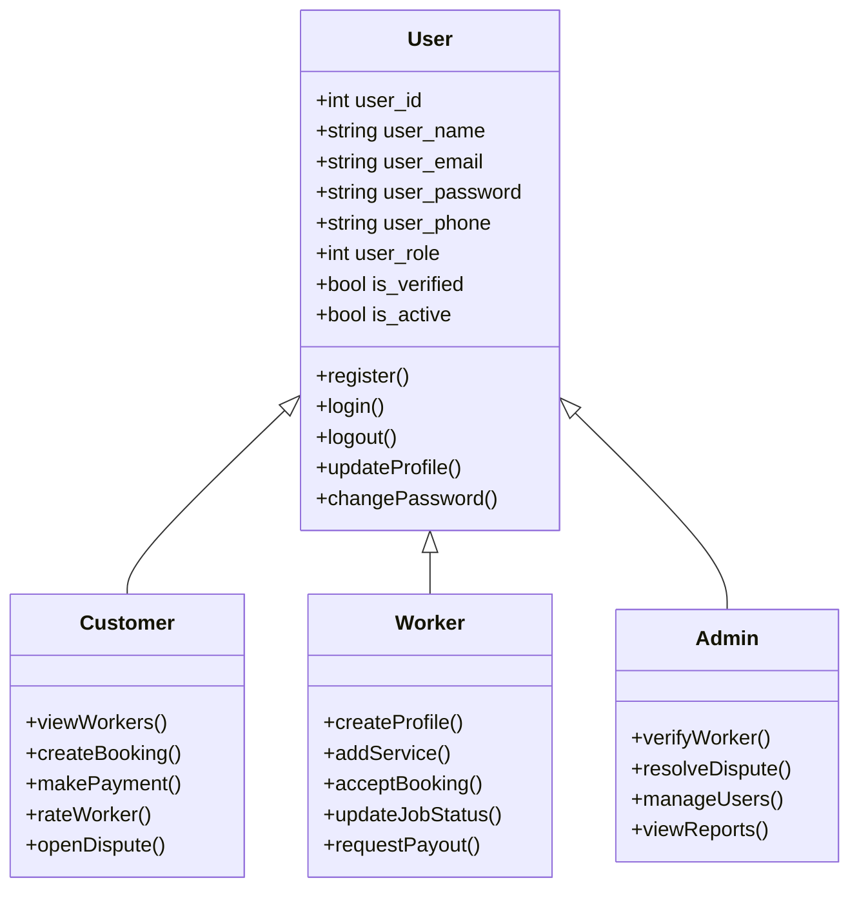

### 10.2 Booking Management Component

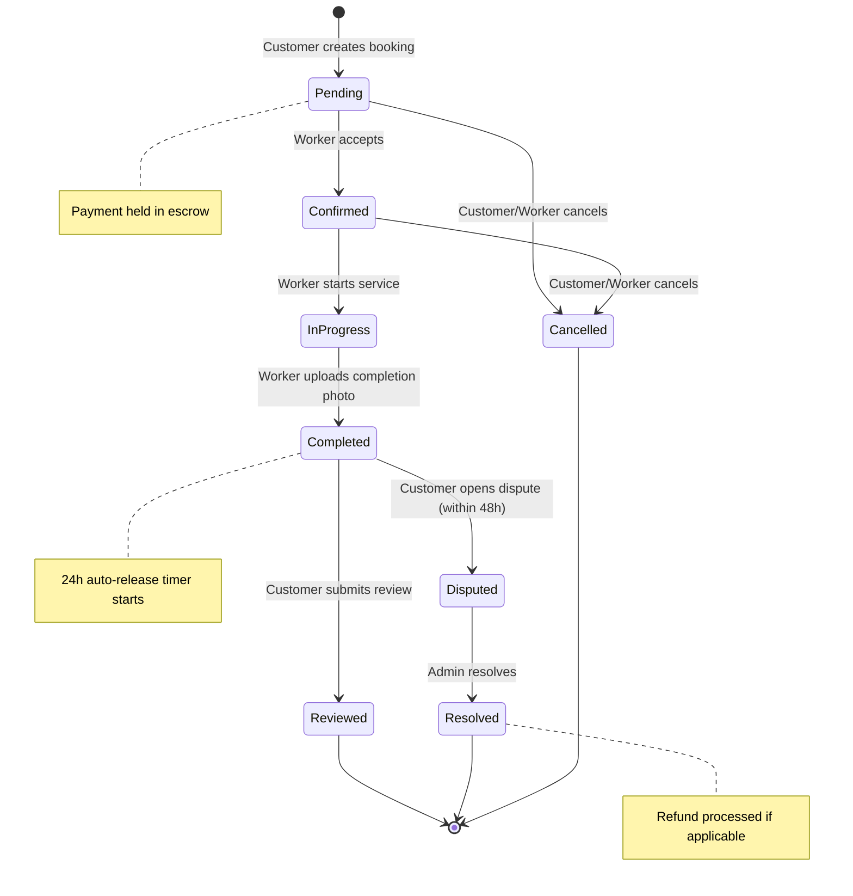

### 10.3 Payment Processing Component

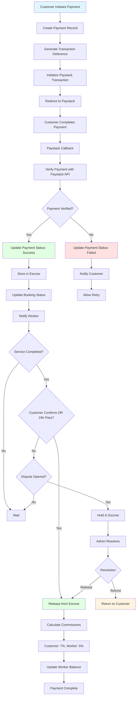

---

## 11. API Endpoints Documentation

### 11.1 Authentication Endpoints

| Endpoint | Method | Description | Parameters | Response |
|----------|--------|-------------|------------|----------|
| `/actions/register_action.php` | POST | Register new user | name, email, password, phone, role | JSON: status, message, user_id |
| `/actions/login_action.php` | POST | User login | email, password | JSON: status, message, redirect |
| `/actions/logout_action.php` | GET | User logout | - | Redirect to home |
| `/actions/change_password.php` | POST | Change password | old_password, new_password | JSON: status, message |

### 11.2 Booking Endpoints

| Endpoint | Method | Description | Parameters | Response |
|----------|--------|-------------|------------|----------|
| `/actions/create_booking_action.php` | POST | Create new booking | worker_id, service_id, date, location, description | JSON: status, booking_id, reference |
| `/actions/update_booking_status.php` | POST | Update booking status | booking_id, status | JSON: status, message |
| `/actions/cancel_booking.php` | POST | Cancel booking | booking_id, reason | JSON: status, message |
| `/actions/get_booking_details.php` | GET | Get booking details | booking_id | JSON: booking data |
| `/actions/upload_completion_photo.php` | POST | Upload completion photo | booking_id, photo | JSON: status, photo_url |

### 11.3 Payment Endpoints

| Endpoint | Method | Description | Parameters | Response |
|----------|--------|-------------|------------|----------|
| `/actions/booking_payment_init.php` | POST | Initialize payment | booking_id | JSON: status, authorization_url |
| `/actions/paystack_verify_payment.php` | POST | Verify payment | reference | JSON: status, payment_data |
| `/actions/process_booking_payment.php` | POST | Process payment | booking_id, reference | JSON: status, message |

### 11.4 Worker Endpoints

| Endpoint | Method | Description | Parameters | Response |
|----------|--------|-------------|------------|----------|
| `/actions/create_worker_profile.php` | POST | Create worker profile | bio, skills, experience, rate | JSON: status, profile_id |
| `/actions/update_worker_profile.php` | POST | Update worker profile | profile_id, fields | JSON: status, message |
| `/actions/create_service.php` | POST | Add new service | title, description, category, price | JSON: status, service_id |
| `/actions/update_service.php` | POST | Update service | service_id, fields | JSON: status, message |
| `/actions/delete_service.php` | POST | Delete service | service_id | JSON: status, message |
| `/actions/search_workers.php` | GET | Search workers | category, location, price, rating | JSON: workers array |

### 11.5 Payout Endpoints

| Endpoint | Method | Description | Parameters | Response |
|----------|--------|-------------|------------|----------|
| `/actions/add_payout_account.php` | POST | Add payout account | account_type, number, name, bank | JSON: status, account_id |
| `/actions/get_payout_accounts.php` | GET | Get payout accounts | worker_id | JSON: accounts array |
| `/actions/set_default_account.php` | POST | Set default account | account_id | JSON: status, message |
| `/actions/request_payout.php` | POST | Request payout | amount, account_id, type | JSON: status, payout_id |
| `/actions/instant_payout.php` | POST | Instant payout | amount, account_id | JSON: status, payout_id, fee |
| `/actions/get_payout_history.php` | GET | Get payout history | worker_id | JSON: payouts array |

### 11.6 Dispute Endpoints

| Endpoint | Method | Description | Parameters | Response |
|----------|--------|-------------|------------|----------|
| `/actions/open_dispute.php` | POST | Open new dispute | booking_id, reason, description, evidence | JSON: status, dispute_id |
| `/actions/respond_to_dispute.php` | POST | Worker responds | dispute_id, response | JSON: status, message |
| `/actions/resolve_dispute.php` | POST | Admin resolves | dispute_id, resolution, outcome, refund | JSON: status, message |
| `/actions/delete_dispute.php` | POST | Delete dispute | dispute_id | JSON: status, message |

### 11.7 Review Endpoints

| Endpoint | Method | Description | Parameters | Response |
|----------|--------|-------------|------------|----------|
| `/actions/submit_review.php` | POST | Submit review | booking_id, rating, review_text | JSON: status, review_id |

---

## 12. Data Flow Diagrams

### 12.1 Level 0 DFD (Context Diagram)

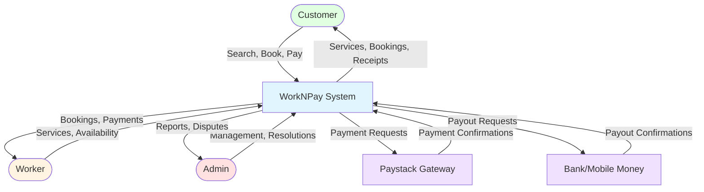

### 12.2 Level 1 DFD (Main Processes)

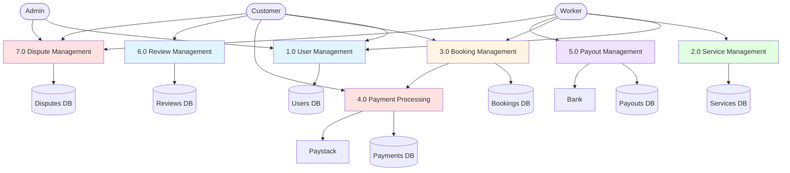

---

## 13. Testing Strategy

### 13.1 Testing Pyramid

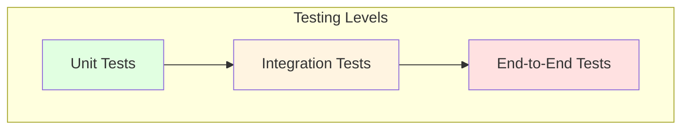

### 13.2 Test Coverage

**Unit Tests** (Classes and Functions)
- User authentication functions
- Payment calculation logic
- Booking status transitions
- Commission calculations
- Data validation functions

**Integration Tests** (Component Interactions)
- Booking creation with payment
- Payment verification with Paystack
- Escrow release workflow
- Payout processing
- Dispute resolution flow

**End-to-End Tests** (User Workflows)
- Complete booking journey (search → book → pay → complete)
- Worker onboarding and service creation
- Payout request and processing
- Dispute opening and resolution
- Review submission

### 13.3 Test Scenarios

**Payment Testing**
- Test card: 4111111111111111
- Expiry: Any future date
- CVV: Any 3 digits
- OTP: 123456

**Booking Status Testing**
```
Pending → Confirmed → In Progress → Completed
Pending → Cancelled
Confirmed → Cancelled
```

**Escrow Testing**
- Payment held after booking
- Auto-release after 24 hours
- Manual release by customer
- Refund on dispute resolution

---

## 14. Performance Considerations

### 14.1 Database Optimization

**Indexes**
```sql
-- Users table
CREATE INDEX idx_user_email ON users(user_email);
CREATE INDEX idx_user_role ON users(user_role);

-- Bookings table
CREATE INDEX idx_booking_customer ON bookings(customer_id);
CREATE INDEX idx_booking_worker ON bookings(worker_id);
CREATE INDEX idx_booking_status ON bookings(booking_status);
CREATE INDEX idx_booking_date ON bookings(booking_date);

-- Payments table
CREATE INDEX idx_payment_booking ON payments(booking_id);
CREATE INDEX idx_payment_reference ON payments(payment_reference);
CREATE INDEX idx_payment_status ON payments(payment_status);

-- Services table
CREATE INDEX idx_service_worker ON services(worker_id);
CREATE INDEX idx_service_category ON services(category_id);
CREATE INDEX idx_service_active ON services(is_active);
```

### 14.2 Caching Strategy

```mermaid
flowchart LR
    A[User Request] --> B{Cache Hit?}
    B -->|Yes| C[Return Cached Data]
    B -->|No| D[Query Database]
    D --> E[Store in Cache]
    E --> F[Return Data]
    
    style B fill:#fff4e1
    style C fill:#e1ffe1
    style D fill:#ffe1e1
```

**Cacheable Data**
- Service categories
- Worker profiles (5 min TTL)
- Service listings (5 min TTL)
- Worker ratings (10 min TTL)
- Static content

### 14.3 Performance Metrics

**Target Metrics**
- Page load time: < 2 seconds
- API response time: < 500ms
- Database query time: < 100ms
- Payment processing: < 5 seconds
- Search results: < 1 second

---

## 15. Scalability Plan

### 15.1 Horizontal Scaling

```mermaid
graph TB
    LB[Load Balancer]
    
    subgraph "Application Tier"
        AS1[App Server 1]
        AS2[App Server 2]
        AS3[App Server 3]
    end
    
    subgraph "Database Tier"
        Master[(Master DB)]
        Slave1[(Slave DB 1)]
        Slave2[(Slave DB 2)]
    end
    
    LB --> AS1
    LB --> AS2
    LB --> AS3
    
    AS1 --> Master
    AS2 --> Slave1
    AS3 --> Slave2
    
    Master -.Replication.-> Slave1
    Master -.Replication.-> Slave2
    
    style LB fill:#e1f5ff
    style Master fill:#e1ffe1
```

### 15.2 Vertical Scaling

**Current Resources**
- Shared hosting (InfinityFree)
- Limited CPU and RAM
- Shared database

**Recommended Upgrade Path**
1. VPS (2 CPU, 4GB RAM)
2. Dedicated Server (4 CPU, 8GB RAM)
3. Cloud Infrastructure (Auto-scaling)

### 15.3 Database Scaling

**Read Replicas**
- Master for writes
- Slaves for reads
- Reduces master load

**Sharding Strategy**
- Shard by user_id
- Shard by geographic region
- Shard by date range

---

## 16. Monitoring and Maintenance

### 16.1 Monitoring Dashboard

```mermaid
graph TB
    subgraph "Monitoring Tools"
        M1[Application Monitoring]
        M2[Database Monitoring]
        M3[Server Monitoring]
        M4[Payment Monitoring]
    end
    
    subgraph "Metrics"
        A1[Response Time]
        A2[Error Rate]
        A3[Active Users]
        A4[API Calls]
    end
    
    subgraph "Database Metrics"
        B1[Query Performance]
        B2[Connection Pool]
        B3[Slow Queries]
        B4[Disk Usage]
    end
    
    subgraph "Server Metrics"
        C1[CPU Usage]
        C2[Memory Usage]
        C3[Disk I/O]
        C4[Network Traffic]
    end
    
    subgraph "Payment Metrics"
        D1[Transaction Volume]
        D2[Success Rate]
        D3[Failed Payments]
        D4[Escrow Balance]
    end
    
    M1 --> A1
    M1 --> A2
    M1 --> A3
    M1 --> A4
    
    M2 --> B1
    M2 --> B2
    M2 --> B3
    M2 --> B4
    
    M3 --> C1
    M3 --> C2
    M3 --> C3
    M3 --> C4
    
    M4 --> D1
    M4 --> D2
    M4 --> D3
    M4 --> D4
```

### 16.2 Maintenance Schedule

**Daily**
- Monitor error logs
- Check payment processing
- Review failed transactions
- Monitor server health

**Weekly**
- Database backup
- Review performance metrics
- Check disk space
- Update security patches

**Monthly**
- Full system backup
- Performance optimization
- Security audit
- Code review

**Quarterly**
- Disaster recovery test
- Penetration testing
- Capacity planning
- Feature review

---

## 17. Future Enhancements

### 17.1 Roadmap

**Phase 1: Core Improvements (Q1 2026)**
- Invoice generation system
- SMS and email notifications
- Enhanced security (CSRF, 2FA)
- Performance optimization
- Mobile app (React Native)

**Phase 2: Feature Expansion (Q2 2026)**
- In-app messaging system
- Advanced search with AI
- Subscription plans for workers
- Discount and coupon system
- Multi-language support

**Phase 3: Scale and Growth (Q3-Q4 2026)**
- Geographic expansion
- Additional service categories
- API for third-party integrations
- Advanced analytics dashboard
- White-label opportunities

### 17.2 Technology Upgrades

**Backend**
- Migrate to Laravel framework
- Implement RESTful API
- Add GraphQL support
- Microservices architecture

**Frontend**
- Progressive Web App (PWA)
- React/Vue.js for dynamic UI
- Mobile apps (iOS/Android)
- Real-time updates with WebSockets

**Infrastructure**
- Cloud migration (AWS/Azure/GCP)
- Kubernetes orchestration
- CI/CD pipeline
- Automated testing

---

## 18. Conclusion

### 18.1 System Summary

WorkNPay is a comprehensive service marketplace platform built with:
- **Robust Architecture**: MVC pattern with clear separation of concerns
- **Secure Payment Processing**: Paystack integration with escrow system
- **User-Centric Design**: Mobile-first, intuitive interfaces
- **Scalable Foundation**: Ready for growth and expansion
- **Complete Workflows**: From service discovery to payment and dispute resolution

### 18.2 Key Achievements

✅ Multi-role user management (Customer, Worker, Admin)
✅ Comprehensive booking system with status tracking
✅ Secure payment processing with escrow protection
✅ Flexible payout system (instant and scheduled)
✅ Dispute resolution mechanism
✅ Rating and review system
✅ Worker verification system
✅ Mobile-responsive design
✅ Clean, well-documented codebase

### 18.3 Documentation Links

- **GitHub Repository**: [https://github.com/oforias/worknpay](https://github.com/oforias/worknpay)
- **Product Requirements**: `PRODUCT_DEVELOPMENT_REQUIREMENTS.md`
- **System Design**: `SYSTEM_ANALYSIS_AND_DESIGN.md` (this document)
- **README**: `README.md`
- **Deployment Guide**: `INFINITYFREE_DEPLOYMENT.md`

---

**Document Version**: 1.0  
**Last Updated**: November 30, 2025  
**Author**: WorkNPay Development Team  
**Platform**: WorkNPay - Ghana Informal Sector Worker Marketplace

---

## Appendix A: Glossary

**Escrow**: A financial arrangement where payment is held by a third party until service completion is confirmed.

**Paystack**: A payment gateway provider that enables online payments in Africa.

**MVC**: Model-View-Controller, a software design pattern that separates application logic.

**API**: Application Programming Interface, a set of protocols for building software applications.

**CRUD**: Create, Read, Update, Delete - basic database operations.

**Session**: A server-side storage of user information across multiple page requests.

**Hash**: A one-way cryptographic function used to secure passwords.

**Commission**: A fee charged by the platform for facilitating transactions.

**Payout**: Transfer of earnings from the platform to a worker's account.

**Dispute**: A formal complaint raised by a customer regarding service quality.

---

## Appendix B: Contact Information

**Platform**: WorkNPay  
**Website**: [To be deployed]  
**GitHub**: https://github.com/oforias/worknpay  
**Support Email**: [To be configured]  
**Developer**: Alan Kofi Safo Ofori

---

*End of System Analysis and Design Documentation*
